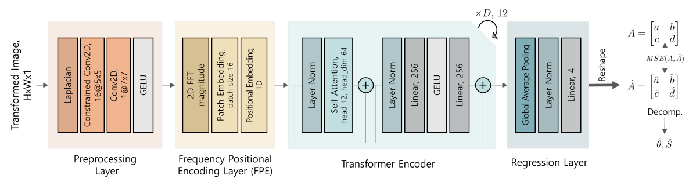
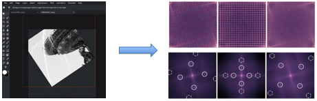
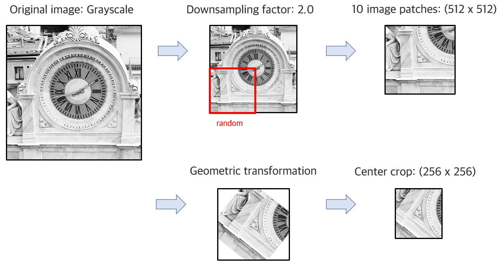

# Transformers in Spectral Domain for Estimating Image Geometric Transformation

> ACM Multimedia 2022

## Overview

The blind estimation of image geometric transformation is an essential problem in digital image forensics. In this paper, we propose an end-to-end transformer-based estimator that can predict the geometric transformation parameters of an image. Deviating from the existing classification-based formulation, we provided a more generalized method by directly estimating the transformation matrix. We note that the frequency peak position of the inherent resampling artifacts leaves explicit clues for the geometric transformation. To use this feature, a direct analysis of the spatial frequency is performed using the positional encoding of fast Fourier transform and multi-head self-attention. Combining the regression layers with the preceding transformer effectively analyzes the geometric transformation parameters of the image. Performing extensive comparison tests with a public database, the proposed method demonstrates a prediction performance higher than existing methods and also demonstrated robustness to JPEG compression.

## Motivation

Digital images can be easily modified. Detecting image geometric transformation is essential problem in forensics. In this case, interpolation leaves a unique trace on the image.

## Setup

- Python 3.7.0 ~ 3.7.9
- CUDA Version 11.0

1. Nvidia driver, CUDA toolkit 11.0, install Anaconda.

2. Install pytorch

        conda install pytorch torchvision cudatoolkit=11.0 -c pytorch

3. Install various necessary packages

        pip install opencv-contrib-python resnest geffnet albumentations pillow scikit-learn scikit-image pandas tqdm pretrainedmodels

4. Install git and LR related packages

        conda install git
        pip install git+https://github.com/ildoonet/pytorch-gradual-warmup-lr.git

## Dataset

- Each image is downsampled by a factor of 2 to avoid interference signals from the color filter array called CFA, interpolation from base image acquisition. Ten image patches were randomly cropped from each image in the dataset.

- The patch images were applied to the geometry transformation and center crop.

- We applied the rotation factor from 1 to 45 degrees. Because the frequency pair for the angle is symmetric in the spectral domain, the angle range is constrained to 45 degrees.

- The scaling factors are between 0.5 and 1.95..

- Three test datasets: rotation only, scaling only, and mixed transformation-based evaluation

## Training

When using Terminal, directly execute the code below after setting the path

	python train.py --kernel-type model_name --out-dim 4 --data-folder images/ --enet-type preconv_seven --n-epochs 200 --init-lr 4e-5 --batch-size 32 --k-fold 0 --image-size 256 --CUDA_VISIBLE_DEVICES 0

## Evaluting

 You can use the model used for training earlier, or you can evaluate it by specifying the model in --model-dir.

	python evaluate.py --kernel-type model_name --out-dim 4 --data-folder images/ --enet-type preconv_seven --n-epochs 200 --batch-size 32 --k-fold 0 --image-size 256 --CUDA_VISIBLE_DEVICES 0

## Acknowledgement

This work was supported by the National Research Foundation of Korea (NRF) grant funded by the Korea government (MSIT) (NRF-2020R1C1C1013433).

